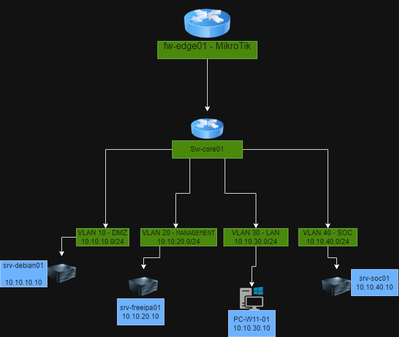

# 02 - Plan de Redes, Topología Lógica y Firewalling (VLANs & Microsegmentación)

Este módulo documenta la segmentación lógica de red, el direccionamiento IP de cada VLAN y la implementación de políticas de seguridad Zero Trust en el firewall de borde (MikroTik RouterOS).

---

## 1. Diagrama de Arquitectura

---

## 2. Tabla de Subredes e Infraestructura

| VLAN | Nombre | Subred | IP Gateway | IP Servidores / Nodos | Función Principal |
| :---: | :--- | :---: | :---: | :--- | :--- |
| **VLAN 10** | DMZ | `10.10.10.0/24` | `10.10.10.1` | `10.10.10.10` (`SRV-DEBIAN-DMZ-01`) | Servidor expuesto / Servicios DMZ (DST-NAT 2222) |
| **VLAN 20** | MANAGEMENT | `10.10.20.0/24` | `10.10.20.1` | `10.10.20.10` (`SRV-WINDOWS-AD-01`) | Active Directory Domain Services + Resolver DNS |
| **VLAN 30** | LAN | `10.10.30.0/24` | `10.10.30.1` | `10.10.30.10-50` (`PC-FINANZAS`, `RRHH`, `VENTAS`) | Estaciones de Trabajo (Asignación por DHCP) |
| **VLAN 40** | SOC | `10.10.40.0/24` | `10.10.40.1` | `10.10.40.10` (`SRV-DEBIAN-SOC-01`) | Central de Monitoreo (Zabbix Server Containerized) |

---

## 3. Políticas de Firewall y Microsegmentación Zero Trust

Se implementó un esquema de **Defensa en Profundidad** utilizando el motor de inspección de estado (*Stateful Firewall*) de MikroTik RouterOS en `/ip firewall filter`.

### Reglas de Filtrado Aplicadas (`Filter Rules`)

| # | Action | Chain | Src. Address | Dst. Address | Protocol / Port | Match Extra | Descripción / Propósito |
| :-: | :---: | :---: | :---: | :---: | :---: | :---: | :--- |
| **0** | `accept` | `forward` | - | - | - | `connection-state=established,related` | **Stateful:** Permite respuestas legítimas de conexiones iniciadas. |
| **1** | `drop` | `forward` | - | - | - | `connection-state=invalid` | Descarta basura de red y paquetes corruptos de entrada. |
| **2** | `accept` | `forward` | `10.10.0.0/16` | `10.10.20.10` | UDP `53` | - | Permite consultas DNS de todas las VLANs al Active Directory. |
| **3** | `accept` | `forward` | - | - | - | `In: ether3` / `Out: ether1` | Permite salida a Internet para clientes de la VLAN 30 (LAN). |
| **4** | `accept` | `input` | `10.10.40.10` | `10.10.0.0/16` | UDP `161` | - | Telemetría SNMP del RouterOS exclusiva para el Zabbix Server. |
| **5** | `accept` | `forward` | `10.10.40.10` | `10.10.0.0/16` | TCP `10050` | - | Permite recolección pasiva de métricas desde el SOC a Agentes. |
| **6** | `accept` | `forward` | - | - | - | `connection-nat-state=dstnat` | **Acceso Remoto:** Permite tráfico que coincida con reglas válidas de DST-NAT (Termius/SSH). |
| **7** | `drop` | `forward` | - | - | - | - | **DROP ALL:** Bloqueo explícito de movimiento lateral Inter-VLAN. |

---

## 4. Registro de Decisiones de Seguridad (Architecture Log)

* **Modelo Default-Drop (Zero Trust):** Todo el tráfico Inter-VLAN no contemplado en las reglas 0 a 6 es bloqueado por la regla 7 (`DROP ALL`).
* **Gestión Remota Dinámica con DST-NAT:** Para evitar abrir puertos de forma global en `forward`, se autoriza únicamente el tráfico con `connection-nat-state=dstnat`. Si una conexión externa hace match con una regla válida de mapeo de puertos en la tabla NAT, pasa automáticamente sin comprometer la seguridad.
* **Optimización Stateful:** La regla `0` (`established,related`) procesa el 95% del tráfico recurrente al inicio de la tabla, reduciendo la carga de CPU del MikroTik.
* **Prevención de Movimiento Lateral:** Si una máquina de la VLAN 30 (LAN) o VLAN 10 (DMZ) es comprometida, el firewall impide el escaneo o salto directo hacia el segmento de Management (`10.10.20.0/24`) o el SOC (`10.10.40.0/24`).
